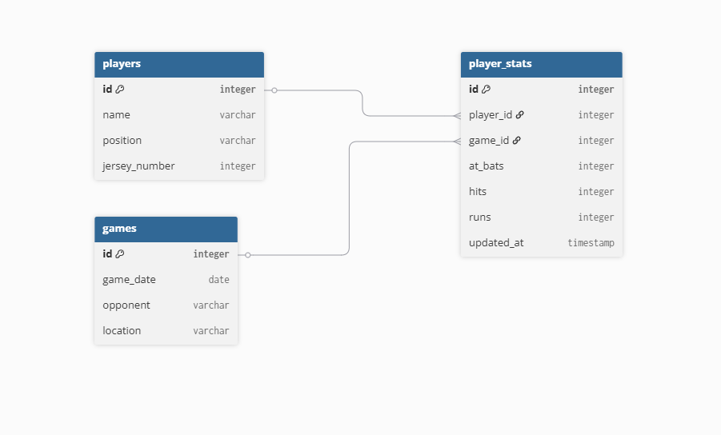

# BMIS-444-Project-1
Baseball Database

Description:
This is a system that is designed to help a baseball coach keep track of team data. It tracks player information, game schedules, and every individual player's performance. I thought this would be an interesting database to make because any coach could use it for their Little League or even high school team. There is a lot of data in baseball, and without a database like this, it is very hard to keep track of. 

ERD:

